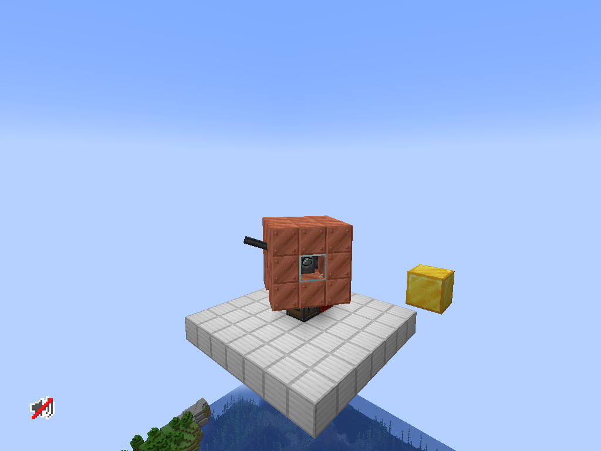

# CBC Tank Tower

CBC Tank Tower is a **Create Big Cannons addon for NeoForge 1.21.1** designed to make tank building more compact. Its turret mount supports blocks attached with Create Super Glue or Aeronautics Honey Glue: they follow horizontal rotation without tilting with the barrel or changing the cannon's stats. More tank-building features are planned for future updates.

## Features

- Native CBC mount model, cannon assembly, aiming, firing and ammunition handling.
- Glued turret armor and other blocks rotate with the gun's horizontal aim while the barrel elevates independently.
- Separate turret contraption preserves the cannon's block count, stress, rotation coefficient and elevation limits.
- Supports big cannons, autocannons, upright/inverted mounts and Aeronautics vehicles.
- Preserves turret blocks, container contents, glue and aim when saving and disassembling.
- No CreateHole dependency.

Find **Turret Cannon Mount** in the **CBC Tank Tower** creative tab. Craft it with a regular CBC cannon mount in the center and four Create brass sheets above, below, left and right. Glue the turret body to the cannon and its neighboring body blocks, then use the normal CBC assembly signal and aiming shafts.



## Requirements

- Minecraft 1.21.1, NeoForge 21.1.252 or later.
- Create 6.0.10 and Create Big Cannons 5.11.7, with their required libraries.
- Optional for gameplay: Aeronautics/Simulated 1.3.2 for Honey Glue.
- Java 21 for development.

Install the same addon JAR on client and server. Glued blocks follow Create's movement and block-count restrictions.

## Build

Third-party mod JARs are not checked into this repository. Prepare development dependencies from a matching installed mod set:

```powershell
powershell -ExecutionPolicy Bypass -File scripts/prepare-dependencies.ps1 -ModsDirectory "C:\path\to\minecraft\mods"
.\gradlew.bat build
```

Set `JAVA_HOME` to a Java 21 installation. The dependency helper extracts Create's bundled compile libraries and the optional Simulated API from Aeronautics bundled 1.3.2. The Simulated JAR is needed to compile honey-glue support even when the addon will be used without Aeronautics.

Output: `build/libs/cbc-tank-tower-0.1.0.jar`. Only addon classes and resources are packaged.

For Linux/macOS, place the same dependencies in `libs/` and run `./gradlew build`.

## Development and validation

`gradlew runClient` and `gradlew runServer` load the packaged addon with Create/CBC. For a full modpack, place its mod JARs in the ignored `runtime-mods/` directory, exclude duplicate CBC Tank Tower JARs, and add `-PtowerFullPack`.

The optional smoke harness is in `src/smoke`. Build it with `gradlew smokeJar`; it is never part of the release JAR. `-PtowerSmoke` enables automatic in-game checks. Use only fresh disposable test worlds: the harness places cannons and moves blocks, then saves a checkpoint for a second launch. Aeronautics physics checks require Sable 2.0.5 and its companion library at compile time. A full client check requires the full runtime mod set.

Validated in real Minecraft clients/servers: 16 cannon/orientation cases, both glue types, native aiming motors and AP firing, container/glue restoration, moving Aeronautics hulls, all 32 CBC mount model states and actual saved-world restarts.

## Русский

CBC Tank Tower — аддон для **Create Big Cannons на NeoForge 1.21.1**, который стремится сделать танкостроение компактнее. Башенное крепление поддерживает блоки, приклеенные суперклеем Create или медоклеем Aeronautics: они вращаются горизонтально, не повторяя наклон ствола и не меняя характеристики пушки. В будущих обновлениях планируются новые возможности для строительства танков.

Блок **«Башенное крепление пушки»** находится во вкладке **CBC Tank Tower**. Рецепт: обычное крепление CBC в центре и четыре латунных листа Create вокруг него. Приклейте корпус башни к пушке и соедините его части клеем, затем подайте штатный сигнал сборки CBC. Наведение и стрельба работают как у обычного крепления.

Сохраняются приклеенные блоки, содержимое контейнеров, клей и углы наведения. Мод поддерживает большие пушки, автопушки, перевёрнутые крепления и технику Aeronautics. CreateHole не является зависимостью.

Для сборки нужны Java 21 и локальные JAR-зависимости указанных выше версий. Подготовьте их скриптом `scripts/prepare-dependencies.ps1`, затем выполните `gradlew.bat build`. Готовый JAR появится в `build/libs/`; установите его на клиент и сервер.

## License

All rights reserved, as declared in the mod metadata. Public source availability does not grant an additional redistribution license. Third-party dependencies retain their own licenses; the Gradle Wrapper is covered by the included third-party license notice.
